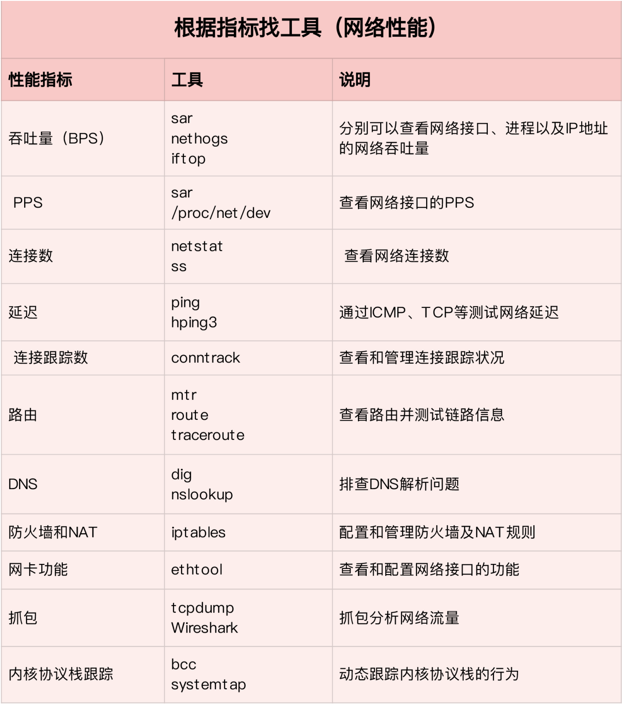
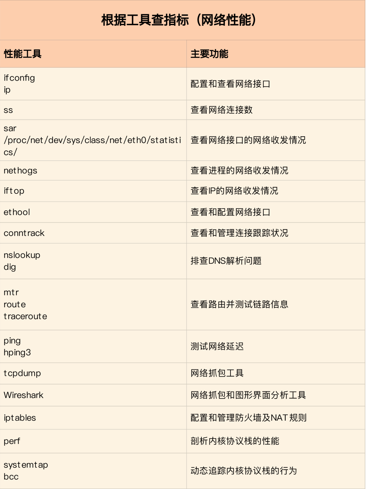

## 套路篇：网络性能优化的几个思路（上）

### 确定优化目标

为了更客观合理地评估优化效果，我们首先应该明确优化的标准，即要对系统和应
用程序进行基准测试，得到网络协议栈各层的基准性能。

首先是网络接口层和网络层，它们主要负责网络包的封装、寻址、路由，以及发送和接
收。每秒可处理的网络包数 PPS，就是它们最重要的性能指标（特别是在小包的情况
下）。你可以用内核自带的发包工具 pktgen ，来测试 PPS 的性能。

再向上到传输层的 TCP 和 UDP，它们主要负责网络传输。对它们而言，吞吐量
（BPS）、连接数以及延迟，就是最重要的性能指标。你可以用 iperf 或 netperf ，来测
试传输层的性能。

不过要注意，网络包的大小，会直接影响这些指标的值。所以，通常，你需要测试一系列
不同大小网络包的性能。

最后，再往上到了应用层，最需要关注的是吞吐量（BPS）、每秒请求数以及延迟等指
标。你可以用 wrk、ab 等工具，来测试应用程序的性能。

不过，这里要注意的是，测试场景要尽量模拟生产环境，这样的测试才更有价值。比如，
你可以到生产环境中，录制实际的请求情况，再到测试中回放。

### 网络性能工具

第一个维度，从网络性能指标出发，你更容易把性能工具同系统工作原理关联起来，对性
能问题有宏观的认识和把握。这样，当你想查看某个性能指标时，就能清楚知道，可以用
哪些工具。

第二个维度，从性能工具出发。这可以让你更快上手使用工具，迅速找出想要观察
的性能指标。特别是在工具有限的情况下，我们更要充分利用好手头的每一个工具，用少
量工具也要尽力挖掘出大量信息。

### 网络性能优化

先要获得网络基准测试报告，然后通过相关性能工具，定位出网络性能瓶颈。

要优化网络性能，肯定离不开 Linux 系统的网络协议栈和网络收发流
程的辅助。

### 应用程序

应用程序，通常通过套接字接口进行网络操作。由于网络收发通常比较耗时，所以应用程
序的优化，主要就是对网络 I/O 和进程自身的工作模型的优化。

参考 [C10K 和 C1000K](./35.md)

### 套接字

套接字可以屏蔽掉 Linux 内核中不同协议的差异，为应用程序提供统一的访问接口。每个
套接字，都有一个读写缓冲区。

- 读缓冲区，缓存了远端发过来的数据。如果读缓冲区已满，就不能再接收新的数据。
- 写缓冲区，缓存了要发出去的数据。如果写缓冲区已满，应用程序的写操作就会被阻塞。

所以，为了提高网络的吞吐量，通常需要调整这些缓冲区的大小。

