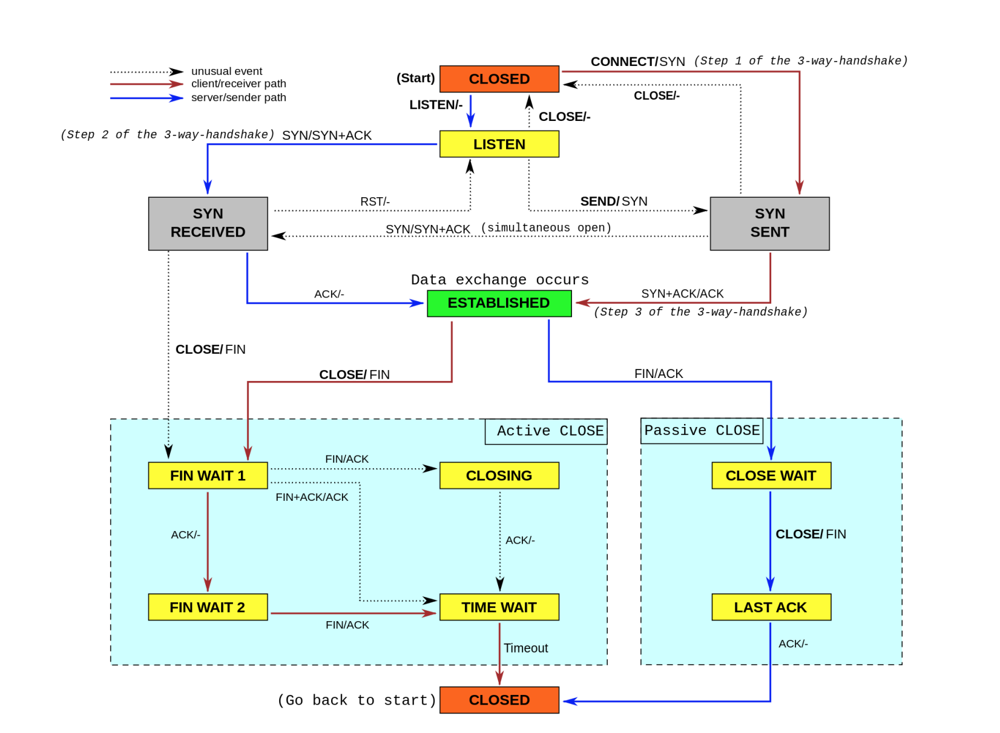

## 套路篇：网络性能优化的几个思路（下）

### 网络性能优化

#### 传输层

传输层最重要的是 TCP 和 UDP 协议，所以传输层的优化，其实主要就是对这两种协议的优化。

TCP 协议的优化

TCP 流图：

分几类情况详细优化说明

第一类，在请求数比较大的场景下，你可能会看到大量处于 TIME_WAIT 状态的连接，它们会占用大量内存和端口资源。这时，我们可以优化与 TIME_WAIT 状态相关的内核选项，比如采取下面几种措施。

1. 增大处于 TIME_WAIT 状态的连接数量 net.ipv4.tcp_max_tw_buckets ，并增大连接跟踪表的大小 net.netfilter.nf_conntrack_max。
2. 减小 net.ipv4.tcp_fin_timeout 和 net.netfilter.nf_conntrack_tcp_timeout_time_wait ，让系统尽快释放它们所占用的资源。
3. 开启端口复用 net.ipv4.tcp_tw_reuse。这样，被 TIME_WAIT 状态占用的端口，还能用到新建的连接中。
4. 增大本地端口的范围 net.ipv4.ip_local_port_range 。这样就可以支持更多连接，提高整体的并发能力。
5. 增加最大文件描述符的数量。你可以使用 fs.nr_open ，设置系统的最大文件描述符数；或在应用程序的 systemd 配置文件中，配置 LimitNOFILE ，设置应用程序的最大文件描述符数。

第二类，为了缓解 SYN FLOOD 等，利用 TCP 协议特点进行攻击而引发的性能问题，你可以考虑优化与 SYN 状态相关的内核选项，比如采取下面几种措施。

1. 增大 TCP 半连接的最大数量 net.ipv4.tcp_max_syn_backlog ，或者开启 TCP SYN Cookies net.ipv4.tcp_syncookies ，来绕开半连接数量限制的问题（注意，这两个选项不可同时使用）。
2. 减少 SYN_RECV 状态的连接重传 SYN+ACK 包的次数 net.ipv4.tcp_synack_retries。

第三类，在长连接的场景中，通常使用 Keepalive 来检测 TCP 连接的状态，以便对端连接断开后，可以自动回收。但是，系统默认的 Keepalive 探测间隔和重试次数，一般都无法满足应用程序的性能要求。所以，这时候你需要优化与 Keepalive 相关的内核选项，比如：

1. 缩短最后一次数据包到 Keepalive 探测包的间隔时间 net.ipv4.tcp_keepalive_time；
2. 缩短发送 Keepalive 探测包的间隔时间 net.ipv4.tcp_keepalive_intvl；
3. 减少 Keepalive 探测失败后，一直到通知应用程序前的重试次数 net.ipv4.tcp_keepalive_probes。

TCP 优化方法表格：

**_优化 TCP 性能时，还要注意，如果同时使用不同优化方法，可能会产生冲突。_**

#### 网络层

网络层，负责网络包的封装、寻址和路由，包括 IP、ICMP 等常见协议。在网络层，最主要的优化，其实就是对路由、 IP 分片以及 ICMP 等进行调优。

第一种，从路由和转发的角度出发，你可以调整下面的内核选项。

1. 在需要转发的服务器中，比如用作 NAT 网关的服务器或者使用 Docker 容器时，开启 IP 转发，即设置 net.ipv4.ip_forward = 1。
2. 调整数据包的生存周期 TTL，比如设置 net.ipv4.ip_default_ttl = 64。注意，增大该值会降低系统性能。
3. 开启数据包的反向地址校验，比如设置 net.ipv4.conf.eth0.rp_filter = 1。这样可以防止 IP 欺骗，并减少伪造 IP 带来的 DDoS 问题。

第二种，从分片的角度出发，最主要的是调整 MTU（Maximum Transmission Unit）的大小。

通常，MTU 的大小应该根据以太网的标准来设置。以太网标准规定，一个网络帧最大为 1518B，那么去掉以太网头部的 18B 后，剩余的 1500 就是以太网 MTU 的大小。

在使用 VXLAN、GRE 等叠加网络技术时，要注意，网络叠加会使原来的网络包变大，导致 MTU 也需要调整。

比如，就以 VXLAN 为例，它在原来报文的基础上，增加了 14B 的以太网头部、 8B 的 VXLAN 头部、8B 的 UDP 头部以及 20B 的 IP 头部。换句话说，每个包比原来增大了 50B。

所以，我们就需要把交换机、路由器等的 MTU，增大到 1550， 或者把 VXLAN 封包前（比如虚拟化环境中的虚拟网卡）的 MTU 减小为 1450。

另外，现在很多网络设备都支持巨帧，如果是这种环境，你还可以把 MTU 调大为 9000，以提高网络吞吐量。

第三种，从 ICMP 的角度出发，为了避免 ICMP 主机探测、ICMP Flood 等各种网络问题，你可以通过内核选项，来限制 ICMP 的行为。

比如，你可以禁止 ICMP 协议，即设置 net.ipv4.icmp_echo_ignore_all = 1。这样，外部主机就无法通过 ICMP 来探测主机。

或者，你还可以禁止广播 ICMP，即设置 net.ipv4.icmp_echo_ignore_broadcasts = 1。

#### 链路层

链路层负责网络包在物理网络中的传输，比如 MAC 寻址、错误侦测以及通过网卡传输网络帧等。自然，链路层的优化，也是围绕这些基本功能进行的。接下来从不同的几个方面分别来看。

由于网卡收包后调用的中断处理程序（特别是软中断），需要消耗大量的 CPU。所以，将这些中断处理程序调度到不同的 CPU 上执行，就可以显著提高网络吞吐量。这通常可以采用下面两种方法。

比如，你可以为网卡硬中断配置 CPU 亲和性（smp_affinity），或者开启 irqbalance 服务。

再如，你可以开启 RPS（Receive Packet Steering）和 RFS（Receive Flow Steering），将应用程序和软中断的处理，调度到相同 CPU 上，这样就可以增加 CPU 缓存命中率，减少网络延迟。

另外，现在的网卡都有很丰富的功能，原来在内核中通过软件处理的功能，可以卸载到网卡中，通过硬件来执行（TSO、GSO、LRO、GRO、RSS、VXLAN）。

最后，对于网络接口本身，也有很多方法，可以优化网络的吞吐量。
