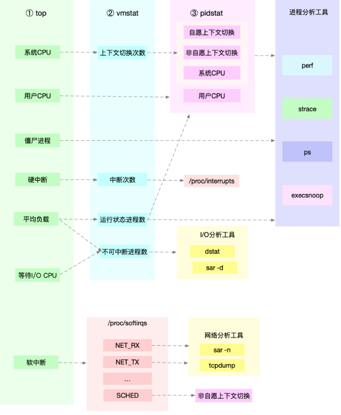
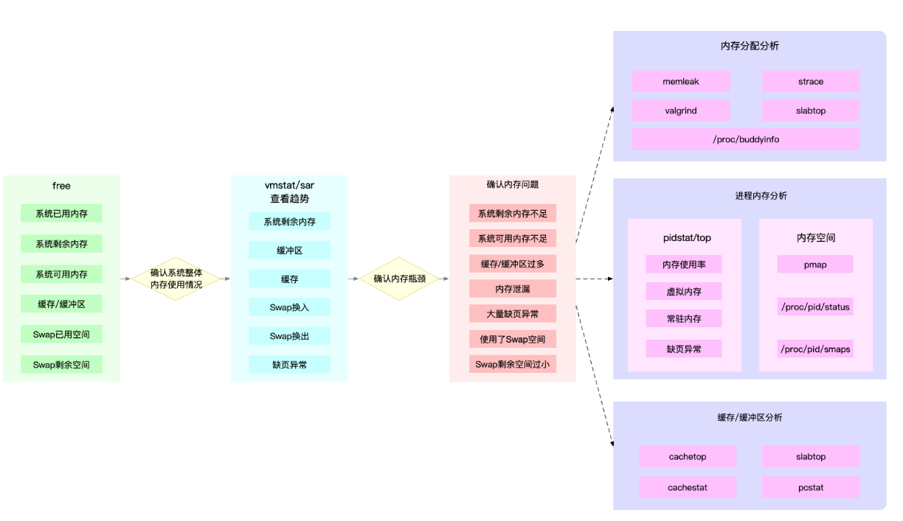
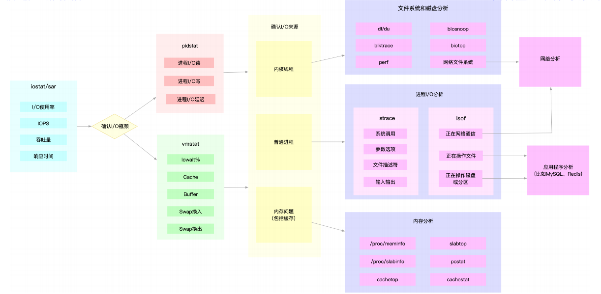

## 套路篇：分析性能问题的一般步骤

应用程序的监控，可以分为指标监控和日志监控两大块。

- 指标监控，主要是对一定时间段内的性能指标进行测量，然后再通过时间序列的方式，进行处
  理、存储和告警。
- 日志监控，则可以提供更详细的上下文信息，通常通过 ELK 技术栈，来进行收集、索引和图
  形化展示。

### 系统资源瓶颈

系统资源的瓶颈，可以通过 USE 法，即使用率、饱和度以及错误数这三类指标来衡量。系统的资源，可以分为硬件资源和软件资源两类。

- 如 CPU、内存、磁盘和文件系统以及网络等，都是最常见的硬件资源。
- 文件描述符数、连接跟踪数、套接字缓冲区大小等，则是典型的软件资源。

从 CPU 性能、内存性能、磁盘和文件系统 I/O 性能以及网络性能等四个方面来进行步骤分析

#### CPU 性能分析

#### 内存性能分析

#### 磁盘和文件系统 I/O 性能分析

#### 网络性能分析

网络性能分析从协议层入手，通过使用率、饱和度以及错误数这几类性能指标，观察是否存在性能问题。比如 ：

- 在链路层，可以从网络接口的吞吐量、丢包、错误以及软中断和网络功能卸载等角度分析；
- 在网络层，可以从路由、分片、叠加网络等角度进行分析；
- 在传输层，可以从 TCP、UDP 的协议原理出发，从连接数、吞吐量、延迟、重传等角度进行分析；
- 在应用层，可以从应用层协议（如 HTTP 和 DNS）、请求数（QPS）、套接字缓存等角度进行分析。

#### 应用程序瓶颈

应用程序性能问题其本质来源，实际上只有三种，也就是资源瓶颈、依赖服务瓶颈以及应用自身的瓶颈。

- 第一种资源瓶颈，其实还是指刚才提到的 CPU、内存、磁盘和文件系统 I/O、网络以及内核资源等各类软硬件资源出现了瓶颈，从而导致应用程序的运行受限。对于这种情况，我们就可以用前面系统资源瓶颈模块提到的各种方法来分析。
- 第二种依赖服务的瓶颈，也就是诸如数据库、分布式缓存、中间件等应用程序，直接或者间接调用的服务出现了性能问题，从而导致应用程序的响应变慢，或者错误率升高。这说白了就是跨应用的性能问题，使用全链路跟踪系统，就可以帮你快速定位这类问题的根源。
- 最后一种，应用程序自身的性能问题，包括了多线程处理不当、死锁、业务算法的复杂度过高等等。对于这类问题，在我们前面讲过的应用程序指标监控以及日志监控中，观察关键环节的耗时和内部执行过程中的错误，就可以帮你缩小问题的范围。
